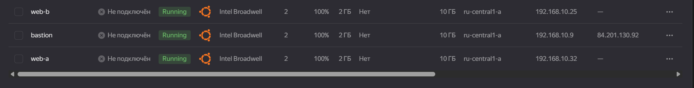
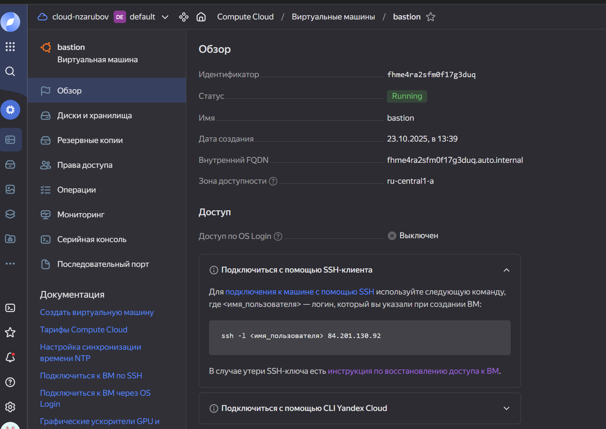
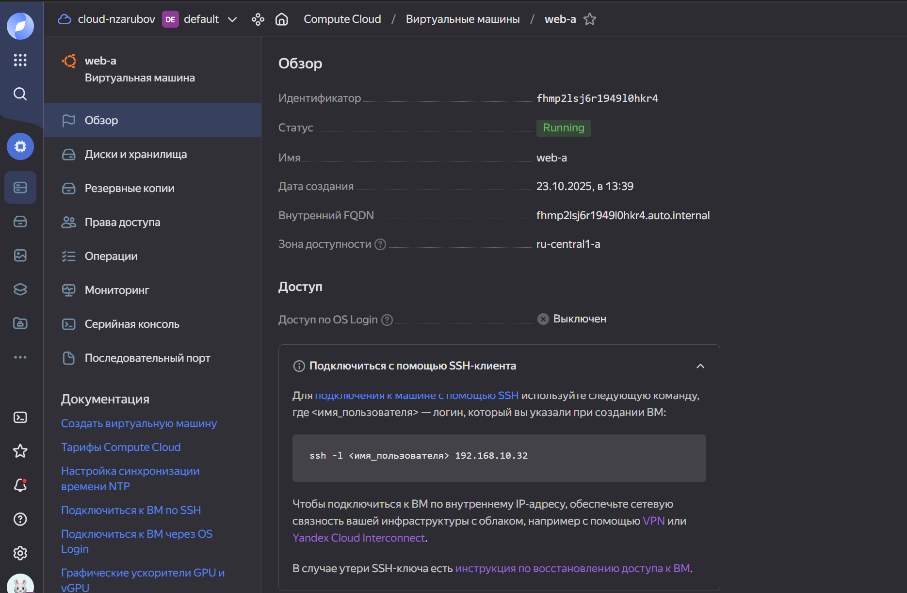
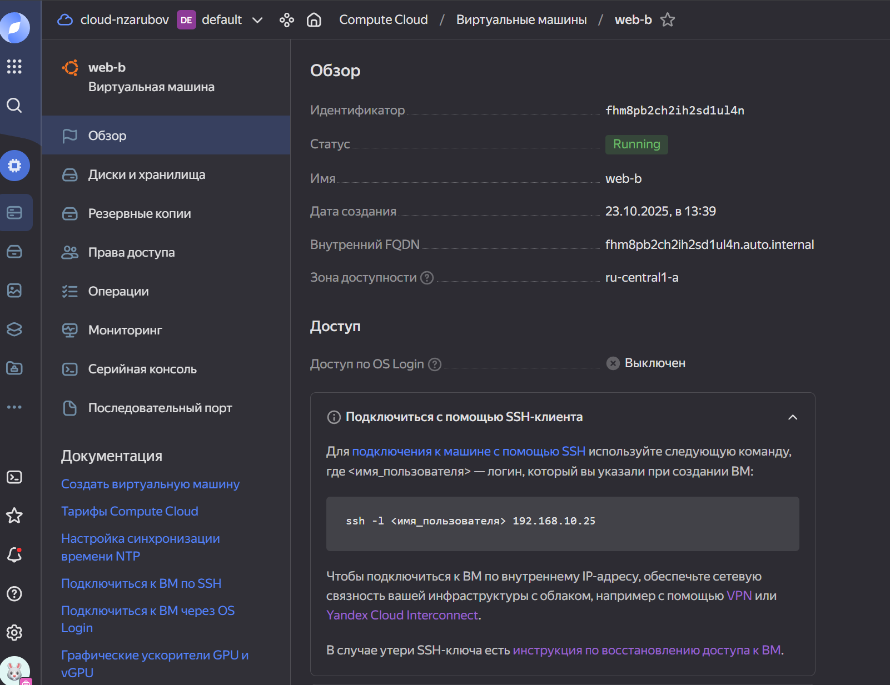
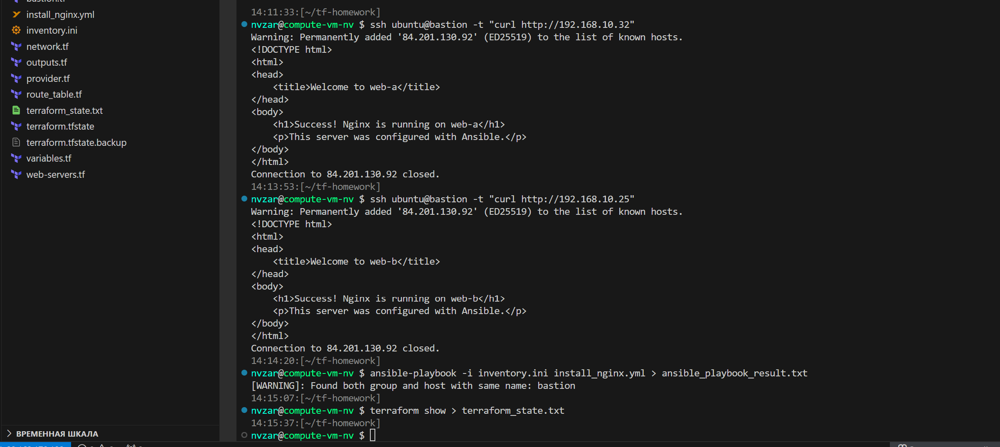

# Домашнее задание 7.3: Подъём инфраструктуры в Yandex Cloud

`Зарубов Николай`

## Описание задания

Развертывание инфраструктуры в Yandex Cloud с использованием Terraform и настройка веб-серверов с помощью Ansible.

## Задание 1: Развертывание инфраструктуры

### Цель
Повторить демонстрацию лекции: развернуть VPC, 2 веб-сервера и бастион-сервер.

### Реализация

#### Архитектура инфраструктуры

┌────────────────────────────────────────────────┐
│ Облако Яндекса (ru-central1-a) │
│ │
│ ┌────────────────────────────────────────┐ │
│ │ Сеть VPC: network1 │ │
│ │ Подсеть: 192.168.10.0/24 │ │
│ │ │ │
│ │ ┌───────────────┐ │ │
│ │ │ Бастион │ Публичный IP │ │
│ │ │ 192.168.10.9 │ 84.201.130.92 │ │
│ │ └──────────────┘ │ │
│ │ │ │ │
│ │ ├────────┬───────────────────│ │
│ │ │ │ │ │ │ │
│ │ ┌──────▼─────┐ ┌▼───────────┐ │ │
│ │ │ Веб-А │ │ Веб-Б │ │ │
│ │ │192.168.10 │ │192.168.10 │ │ │
│ │ │ .32 │ │ .25 │ │ │
│ │ │ (nginx) │ │ (nginx) │ │ │
│ │ └────────────┘ └─────────────┘ │ │
│ │ │ │ │ │
│ │ └──────┬────────┘ │ │
│ │ │ │ │ │
│ │ │ ┌──────▼──────┐ │ │
│ │
│ Шлюз NAT │ │ │ │ │ └─────────────┘ │ │
│ └──────────────────────────────────────────────┘ │
└──────────────────────────────────────────────────┘

текст

#### Созданные ресурсы

| Ресурс | Имя | Публичный IP | Приватный IP | Описание |
|--------|-----|--------------|--------------|----------|
| VM | bastion | 84.201.130.92 | 192.168.10.9 | Bastion-хост для доступа к внутренним серверам |
| VM | web-a | - | 192.168.10.32 | Веб-сервер с nginx |
| VM | web-b | - | 192.168.10.25 | Веб-сервер с nginx |
| Network | network1 | - | 192.168.10.0/24 | VPC сеть |
| Subnet | subnet1 | - | 192.168.10.0/24 | Подсеть в зоне ru-central1-a |
| Route Table | route-table | - | - | Таблица маршрутизации с NAT Gateway |

#### Terraform конфигурация

Проект состоит из следующих файлов:

- `provider.tf` - настройка провайдера Yandex Cloud
- `variables.tf` - переменные проекта
- `network.tf` - VPC и subnet
- `route_table.tf` - таблица маршрутизации с NAT Gateway
- `bastion.tf` - bastion-сервер
- `web-servers.tf` - веб-серверы (web-a, web-b)
- `outputs.tf` - выходные значения (IP адреса)

### Результаты выполнения

применить терраформирование

текст

**Outputs:**
bastion_private_ip = "192.168.10.9"
bastion_public_ip = "84.201.130.92"
web_a_private_ip = "192.168.10.32"
web_b_private_ip = "192.168.10.25"

текст

### Скриншоты

#### Список виртуальных машин в Yandex Cloud Console


#### Bastion сервер


#### Web-A сервер


#### Web-B сервер


---

## Задание 2: Установка nginx через Ansible

### Цель
С помощью Ansible подключиться к web-a и web-b, установить на них nginx.

### Реализация

#### Ansible Inventory

Файл `inventory.ini`:
[веб-серверы]
web-a ansible_host=192.168.10.32
web-b ansible_host=192.168.10.25

[webservers:vars]
ansible_user=ubuntu
ansible_ssh_private_key_file=~/.ssh/id_rsa
ansible_ssh_common_args='-o ProxyJump=bastion -o StrictHostKeyChecking=no'

[бастион]
бастион ansible_host=84.201.130.92 ansible_user=ubuntu

текст

#### Ansible Playbook

Playbook `install_nginx.yml` выполняет следующие задачи:
1. Обновление apt кэша
2. Установка nginx
3. Запуск и включение nginx в автозагрузку
4. Создание кастомной страницы index.html

имя: Установка и настройка nginx на веб-серверах
хосты: веб-серверы
стать: да
задачи:

имя: Обновить кэш apt
apt:
update_cache: да

имя: Установить nginx
apt:
имя: nginx
состояние: присутствует

имя: Запустить и включить службу nginx
systemd:
имя: nginx
состояние: запущен
включен: да

Имя: Создать пользовательский index.html
копия:
содержимое: |
<!DOCTYPE html>
<html>
<head>
<title> Добро пожаловать в {{ inventory_hostname }} </title>
</head>
<body>
<h1> Успех! Nginx работает на {{ inventory_hostname }} </h1>
<p> Этот сервер был настроен с помощью Ansible. </p>
</body>
</html>
dest: /var/www/html/index.html

текст

### Результаты выполнения

ansible-playbook -i inventory.ini install_nginx.yml

текст

**PLAY RECAP:**
web-a: ok=6 изменено=3 недостижимо=0 не удалось=0 пропущено=0 восстановлено=0 проигнорировано=0
web-b: ok=6 изменено=3 недостижимо=0 не удалось=0 пропущено=0 восстановлено=0 проигнорировано=0

текст

### Проверка работы nginx

#### Тестирование доступа к web-a
ssh ubuntu@bastion -t "curl http://192.168.10.32 "

текст

**Результат:**
<!DOCTYPE html> <html> <head> <title>Добро пожаловать в web-a</title> </head> <body> <h1>Успех! Nginx работает на web-a</h1> <p>Этот сервер настроен с помощью Ansible.</p> </body> </html> ```
Тестирование доступа к web-b
текст
ssh ubuntu@bastion -t "curl http://192.168.10.25"
Результат:

текст
<!DOCTYPE html>
<html>
<head>
    <title>Welcome to web-b</title>
</head>
<body>
    <h1>Success! Nginx is running on web-b</h1>
    <p>This server was configured with Ansible.</p>
</body>
</html>
Структура проекта
текст
tf-homework/
├── README.md                      # Документация проекта
├── provider.tf                    # Конфигурация провайдера Yandex Cloud
├── variables.tf                   # Переменные
├── network.tf                     # VPC и subnet
├── route_table.tf                 # Таблица маршрутизации
├── bastion.tf                     # Bastion сервер
├── web-servers.tf                 # Веб-серверы
├── outputs.tf                     # Выходные значения
├── inventory.ini                  # Ansible inventory
├── install_nginx.yml              # Ansible playbook
├── authorized_key.json            # Ключ сервисного аккаунта (не в git)
└── report/                        # Отчёты о выполнении
    ├── terraform_outputs.txt
    ├── ansible_summary.txt
    └── nginx_test.txt
Инструкция по развертыванию
Предварительные требования
Yandex Cloud CLI установлен и настроен

Терраформирование >= 0,13

Ansible >= 2.10

SSH-ключи созданы ( ~/.ssh/id_rsa, ~/.ssh/id_rsa.pub)

Сервисный аккаунт с правами editorв Яндекс Облаке

Шаги развертывания
Клонировать репозитории

текст
git clone <repository-url>
cd tf-homework
Создать переменные

Отредактировать provider.tf(указать Cloud_id и Folder_id)

Добавить файл authorized_key.jsonс ключом сервисного аккаунта

Инициализировать Terraform

текст
terraform init
Развернуть инфраструктуру

текст
terraform plan
terraform apply -auto-approve
Установить nginx через Ansible

текст
ansible-playbook -i inventory.ini install_nginx.yml
Проверить работу



текст
# Получить IP адреса
terraform output

# Проверить nginx
ssh ubuntu@<bastion_ip> -t "curl http://<web-a_private_ip>"
ssh ubuntu@<bastion_ip> -t "curl http://<web-b_private_ip>"
Очистка ресурсов
Для удаления всех созданных ресурсов:

текст
terraform destroy -auto-approve


